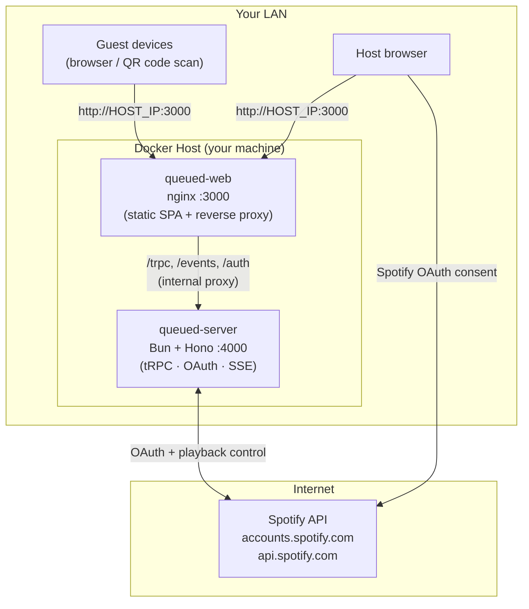

# Self-Hosting Queued

Run Queued on any machine on your LAN with Docker. Guests connect via QR code — no cloud needed.

## Architecture



**One port, everything proxied**: the web container (nginx) serves the React SPA and
transparently proxies `/trpc`, `/events/*`, and `/auth/*` to the server container.
The server is never exposed directly.

**No database**: sessions live in-memory on the server process. Restarting the server ends all active sessions.

---

## Prerequisites

- [Docker](https://docs.docker.com/get-docker/) with Docker Compose
- A [Spotify Developer app](https://developer.spotify.com/dashboard)

---

## 1. Register a Spotify App

1. Go to the [Spotify Developer Dashboard](https://developer.spotify.com/dashboard)
2. Create a new app (any name)
3. Under **Redirect URIs**, add:
   ```
   http://YOUR_HOST_IP:WEB_PORT/auth/callback
   ```
   Replace `YOUR_HOST_IP` with the LAN IP of the machine running Docker (e.g. `192.168.1.42`) and `WEB_PORT` with the port you'll use (default: `3000`).
4. Save your **Client ID** and **Client Secret**

---

## 2. Configure Environment

```bash
cp .env.docker.example .env
```

Edit `.env`:

```env
SPOTIFY_CLIENT_ID=your_client_id_here
SPOTIFY_CLIENT_SECRET=your_client_secret_here

# All three must use the SAME port as WEB_PORT — nginx handles everything on one port
SPOTIFY_REDIRECT_URI=http://192.168.1.42:3000/auth/callback
APP_URL=http://192.168.1.42:3000
CORS_ORIGIN=http://192.168.1.42:3000

PORT=4000
WEB_PORT=3000  # if you change this, update the three URLs above to match
```

> **Tip**: find your LAN IP with `ipconfig getifaddr en0` (macOS) or `hostname -I` (Linux).

---

## 3. Pull and Start

```bash
docker compose pull
docker compose up -d
```

Open `http://YOUR_HOST_IP:3000` in your browser.

---

## 4. Host a Session

1. Click **New Session**, enter a session name and your name
2. Complete the Spotify authorization flow
3. On the session page, click **⚙ settings** to pick your active Spotify Connect device
4. Share the QR code or URL — guests open it in their browser and queue songs

---

## Environment Variables Reference

| Variable | Description |
|----------|-------------|
| `SPOTIFY_CLIENT_ID` | From Spotify Developer Dashboard |
| `SPOTIFY_CLIENT_SECRET` | From Spotify Developer Dashboard |
| `SPOTIFY_REDIRECT_URI` | Must match what you registered in Spotify — `http://HOST_IP:WEB_PORT/auth/callback` |
| `APP_URL` | Public URL of the web app — `http://HOST_IP:WEB_PORT` |
| `CORS_ORIGIN` | Same as `APP_URL` |
| `PORT` | Internal server port (default: `4000`, don't change) |
| `WEB_PORT` | Host port for the web container (default: `3000`) — **must match the port in the three URLs above** |

---

## Updating

```bash
docker compose pull
docker compose up -d
```

> Sessions are in-memory and will be lost on server restart.

---

## Building Your Own Images

Bump `VERSION` in `build-and-push.sh`, then:

```bash
./build-and-push.sh
```

This builds both images from the monorepo root and pushes them to DockerHub with the version tag and `latest`.
